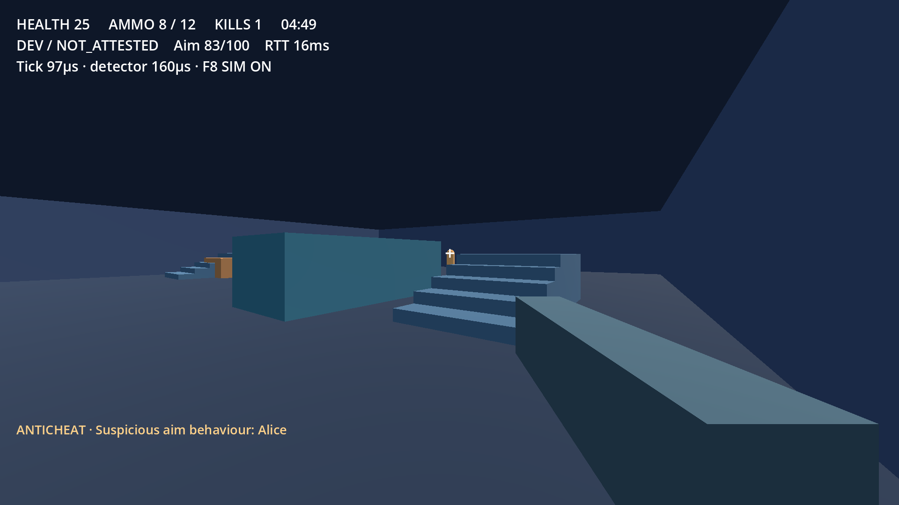

# MiddlewareAnticheatv2 · Arena Lab v0.1.0

FPS multijugador experimental para Linux/Fedora, con servidor dedicado
**autoritativo**, laboratorio interno de aim assist y detección de comportamiento
observable desde el servidor. Incluye el laboratorio C11/TLS y los experimentos
TPM/IMA desarrollados anteriormente como subsistemas independientes.

**Esta versión es jugable en modo de desarrollo sin atestación del cliente.**
La admisión TPM del FPS no está integrada: todos los jugadores aparecen como
`NOT_ATTESTED_DEV`. Una Quote válida no da acceso al juego. El servidor rechaza
arrancar sin `--development`. No se presenta como anticheat de producción.

[Estado y pruebas de v0.1.0](docs/release-status.md) ·
[Modelo de amenazas](docs/threat-model.md) ·
[Protocolo de juego](docs/game-network-protocol.md) ·
[Componentes y licencias](THIRD_PARTY_NOTICES.md)



## 1. Descargar y preparar ambos Fedora

Requisitos del juego: Linux **x86_64**, Python **3.11 o posterior**, Godot
**4.7.2 estable**, escritorio con OpenGL 3.3 y red IPv4. El servidor headless no
requiere escritorio. El FPS no necesita compilar C ni acceder al TPM.

```bash
# Sólo si faltan git/Python:
sudo dnf install git python3

git clone https://github.com/Santiagovargas32/MiddlewareAnticheatv2.git
cd MiddlewareAnticheatv2
python3 tools/prepare_godot.py
./game-client --version
./game-client
```

También sirve **Code → Download ZIP** en GitHub: extraer, entrar en la carpeta y
seguir desde `python3 tools/prepare_godot.py`. Si el ZIP no conserva permisos:

```bash
chmod +x game-client game-server
```

El preparador descarga el motor oficial y comprueba SHA512 del archivo y SHA256
del ejecutable. Lo guarda en `results/toolchain/godot-4.7.2/`, sin root ni cambios
globales. Repetirlo comprueba la copia existente; no reemplaza una copia distinta.
Internet sólo es necesario para esta preparación. La partida se comunica por LAN.

Los lanzadores prefieren ese motor local. Se puede usar
`GODOT_BIN=/ruta/al/godot ./game-client`; se comprueba que sea 4.7.2 estable.
No mezclar versiones ni revisiones de scripts entre clientes y servidor.

## 2. PC A: servidor y primer jugador

Consultar la IPv4 de la interfaz LAN:

```bash
ip -4 addr
./game-server --development --port 7777
```

Mantener esa terminal abierta. El servidor escucha UDP 7777 en las interfaces del
equipo. En otra terminal de PC A:

```bash
./game-client --join 127.0.0.1 --port 7777 --name Alice
```

También se puede abrir `./game-client` y usar JOIN GAME. **HOST GAME** inicia un
servidor dedicado como proceso hijo y conecta al jugador local; ese servidor se
detiene al salir del anfitrión. El servidor de terminal es independiente.
No iniciar ambas opciones sobre el mismo puerto.

## 3. PC B: segundo jugador de la LAN

En la misma revisión del repositorio, después de preparar Godot:

```bash
./game-client --join 192.168.1.50 --port 7777 --name Bob
```

Sustituir `192.168.1.50` por la dirección real de PC A. La misma información puede
introducirse con ratón en JOIN GAME: IP, PORT, PLAYER NAME → CONNECT.
Los nombres admiten 1–24 caracteres de identificador, sin espacios; deben ser
únicos dentro de la sesión.

Ambos jugadores pulsan **READY** en el lobby. Con dos o más jugadores preparados
empieza FFA. Se admiten hasta ocho conexiones; se han probado dos clientes locales.
Durante una partida se rechazan nuevas incorporaciones; conectar de nuevo al
terminar. No hay matchmaking, discovery, NAT traversal ni reenvío de puertos.

### Firewall y problemas de conexión

Estar en la misma red no garantiza que UDP esté permitido. En PC A consultar:

```bash
sudo firewall-cmd --get-active-zones
```

Si firewalld bloquea el puerto, el operador puede abrirlo **temporalmente** en la
zona de su interfaz LAN (ejemplo `home`; sustituirla por la real):

```bash
sudo firewall-cmd --zone=home --add-port=7777/udp
# Al terminar:
sudo firewall-cmd --zone=home --remove-port=7777/udp
```

No desactivar el firewall ni exponer el servidor a Internet. El programa no cambia
la red automáticamente. Si no conecta, comprobar IP, puerto UDP, misma versión,
servidor arrancado, nombres distintos y aislamiento de clientes Wi-Fi. `ping` no
comprueba el puerto UDP. Si el puerto está ocupado, usar otro en ambos equipos.

## 4. Jugar y usar el laboratorio

| Entrada | Acción |
| --- | --- |
| WASD / ratón | Movimiento / cámara y aim |
| Botón izquierdo | Disparo |
| Space / R | Salto / recarga |
| TAB | Marcador: jugador, kills, deaths, RTT propio, aim score |
| Escape | Menú de partida / liberar ratón |
| F11 | Fullscreen / ventana |
| F8 | Activar/desactivar simulación interna de aim |

Ventana inicial 1280×720, diseño y fullscreen comprobados a 1920×1080; admite
resize. El servidor controla velocidad, colisiones, cadencia, munición, recarga,
raycasts, daño, vida, muerte y respawn. Partida: 15 kills o 300 segundos;
recarga 1.4 s, cargador 12, daño 25 y respawn 3 s.

En **ANTICHEAT LAB** se puede habilitar seguimiento preciso y adquisición repetida.
El simulador pertenece exclusivamente a este juego: no inspecciona memoria ni
procesos externos. El servidor **no recibe el toggle**; calcula score a partir de
mirada, cambios angulares y objetivos visibles. Emite `ANTICHEAT_ALERT` cuando
alcanza el umbral experimental; el juego muestra el aviso. Una anomalía aislada
no determina que un jugador haga trampas.

La adquisición repetida ha producido alertas en los ensayos automatizados. El
seguimiento continuo de otra trayectoria **no** alcanzó el umbral; se conserva
ese resultado negativo. No hay una tasa de falsos positivos humanos validada.

## 5. Configuración

Copiar el archivo de referencia para mantener la distribución original:

```bash
cp game/server.cfg /tmp/arena-server.cfg
# Editar /tmp/arena-server.cfg
./game-server --development --port 7777 --config /tmp/arena-server.cfg
```

| Parámetro en `server.cfg` | Predeterminado | Rango / valores |
| --- | --- | --- |
| `match/tick_rate` | 60 Hz | 20–120 |
| `match/snapshot_rate` | 20 Hz | 10–60 |
| `match/max_players` | 8 | 2–8 |
| `match/duration_seconds` | 300 | 10–3600 |
| `match/frag_limit` | 15 | 1–100 |
| `anticheat/threshold` | 75 | 1–100 |
| `anticheat/action` | WARN | LOG_ONLY / WARN |

La sintaxis es INI de Godot, como el archivo incluido. Valores inválidos impiden
arrancar. SPECTATE/KICK y parámetros de admisión TPM no están implementados.
La sensibilidad del ratón se configura en SETTINGS y se guarda en `user://`.

## 6. Telemetría, datasets e integridad de archivos

Godot guarda datos de usuario fuera del repositorio, normalmente en
`~/.local/share/godot/app_userdata/Middleware • Arena Lab/`:

- Servidor: `server-session-<sesion>.jsonl`, con observaciones, scores y alertas.
- Cada cliente: `ground-truth-<pid>.jsonl`, con estado del simulador; se une **offline**.
- Preferencias: `settings.cfg`.

El servidor usa identificadores de sesión, no nombres de procesos o archivos
ajenos al juego. Tope de 200000 observaciones por arranque; no es un servicio de
retención continua. Las medidas de CPU/RTT son diagnósticos locales.

```bash
python3 tools/analyze_match.py datasets/aimbot/snap-cycle.jsonl \
  --ground-truth datasets/aimbot/snap-cycle-A.jsonl \
  --ground-truth datasets/aimbot/snap-cycle-B.jsonl
```

Para una prueba propia, copiar el log de PC A y los ground truth de ambos clientes
y sustituir las rutas. Se ejecuta el **mismo detector** antes de unir etiquetas.
Salida: TP/TN/FP/FN por muestra, precision, recall, tasas y latencia en ticks
observados; cocientes sin denominador son `null`. No se comparan relojes
monotónicos entre equipos. Una última línea truncada se omite y se contabiliza.
[Datasets y limitaciones estadísticas](datasets/README.md).

Manifiesto local contra una referencia distribuida por un canal fiable:

```bash
python3 tools/client_manifest.py create /tmp/client-manifest.json
python3 tools/client_manifest.py verify /tmp/client-manifest.json
```

Crear la referencia en una copia conocida, trasladarla al otro equipo y ejecutar
allí sólo `verify`. Cubre los archivos del juego y lanzadores indicados por la
herramienta; no el motor, drivers ni memoria del proceso. Un PASS es una
comparación local autodeclarada y no concede acceso ni prueba ausencia de cheats.

## 7. Arquitectura y laboratorio anterior

```text
Godot cliente ── intenciones ENet ──> Godot servidor dedicado
  cámara/UI <── estado y alertas ─── física, FFA, reglas y detector

Laboratorio independiente: C11 + Python + TLS + TPM/IMA
  attestor ── challenge/Quote ──> verifier con AK fijada por operador
  (admisión del FPS todavía pendiente)
```

| Directorio | Función |
| --- | --- |
| `game/` | Escenas, UI, física, red, servidor FPS, detector y simulador |
| `lab/` | Contratos UDP, reglas cardinales C, recursos Linux/Windows, decoder TPM/IMA y visor opcional |
| `scripts/` | Supervisión Python, TLS, pruebas UDP/C/TPM/IMA |
| `tools/` | Preparación, lanzadores, pruebas FPS, análisis y empaquetado |
| `tests/`, `game/tests/` | Pruebas C/Python y Godot |
| `datasets/`, `docs/` | Ensayos controlados y documentación pública |

El FPS no reescribe TPM/IMA en GDScript. `arena/1` de Godot,
[lab-udp/2](docs/lab-udp-protocol.md),
[lab-game-input/1](docs/c-game-core.md) y
[lab-attest/1](docs/tpm-attestation.md) son contratos separados.

### Compilar y verificar C/TPM, opcional para jugar

En Fedora, instalar las dependencias que falten:

```bash
sudo dnf install gcc cmake ninja-build openssl openssl-devel tpm2-tools tpm2-tss-devel
cmake -S . -B build -G Ninja -DCMAKE_BUILD_TYPE=Release -DCMAKE_C_FLAGS=-Werror
cmake --build build --parallel 2
ctest --test-dir build --output-on-failure
python3 scripts/lab.py demo
```

Para el decoder TPM y las **fixtures software**:

```bash
cmake -S . -B build-tpm -G Ninja -DCMAKE_BUILD_TYPE=Release -DCMAKE_C_FLAGS=-Werror -DLAB_TPM=ON
cmake --build build-tpm --parallel 2
ctest --test-dir build-tpm --output-on-failure
python3 scripts/verificar-atestacion.py
python3 scripts/verificar-ima-quote.py
```

Para el **TPM físico**, sólo después de que el operador disponga de lectura/escritura
sobre `/dev/tpmrm0`:

```bash
python3 scripts/verificar-tpm-hardware.py
```

La herramienta crea contextos transitorios; no cambia permisos, firmware, arranque,
NV ni políticas. No ejecutar limpieza global de contextos para reparar fallos.
La confianza es AK fijada por operador, no identidad EK completa. Dar permisos al
TPM en PC B **no integra** la atestación con el juego. Ver el
[experimento TPM](docs/tpm-attestation.md) y sus límites de política/IMA.

Visor raylib previo, opcional e independiente del FPS:

```bash
python3 scripts/preparar-raylib.py
cmake -S . -B build-graphics -G Ninja -DLAB_GRAPHICS=ON -DCMAKE_BUILD_TYPE=Release
cmake --build build-graphics --parallel 2
python3 scripts/jugar.py --scripted --seconds 5
```

Windows es una extensión opcional: `python3 scripts/verificar-windows.py` comprueba
compilación PE con MinGW, **no ejecución en Windows**. Las suites del puente TLS
usan trabajadores Linux propios. No confundirlas con el transporte ENet del FPS.

## 8. Pruebas y paquete entregable

```bash
python3 tools/verify_release.py              # FPS headless, herramientas y documentación
python3 tools/verify_game.py --graphical     # dos ventanas reales; se cierran solas
python3 scripts/verificar-build.py
python3 scripts/verificar-integracion.py --direct
python3 scripts/verificar-integracion.py --via-adapter
python3 scripts/verificar-capacidades.py
python3 scripts/verificar-puente.py
python3 scripts/verificar-cli.py
```

Las tres últimas suites requieren `build/` preparado. Para ASan/UBSan, instalar
sus runtimes (`sudo dnf install libasan libubsan`) y añadir `--sanitize` a la
integración correspondiente. Todas las pruebas usan procesos propios y plazos;
un bloqueo de sockets no cuenta como prueba aprobada. [Cobertura](tests/README.md).

```bash
mkdir -p results
python3 tools/package_game.py --output results/MiddlewareAnticheatv2-v0.1.0.tar.gz
```

El paquete contiene fuentes públicos, lanzadores ejecutables y `PACKAGE.json`
con hashes; puede extraerse en una carpeta nueva y seguir desde el paso 1. No
incluye binarios del motor, cachés, credenciales, historiales del host ni resultados
privados. GitHub conserva un único commit inicial para esta versión; las siguientes
versiones añadirán historial sobre esa base.

## Límites de esta entrega

Admisión TPM, enrollment completo, Quote/IMA físico conjunto, política de
mediciones y revocación siguen pendientes. ENet no está cifrado ni autentica la
plataforma; usar una LAN de ensayo controlada. Hay interpolación de snapshots,
pero no predicción, reconciliación o lag compensation. Faltan campaña humana de
falsos positivos, medidas de red prolongadas y validación física entre dos Fedora.
Las pruebas locales de varios procesos y las ventanas reales no sustituyen esa
última comprobación.

**Sin licencia de reutilización por ahora**, por decisión del titular.
[Licencias y avisos de terceros](THIRD_PARTY_NOTICES.md).
