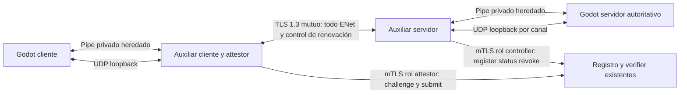

# 0010 — Enlace autenticado entre attestor y peer del FPS

Estado: **aceptada como base experimental de implementación**, no habilita protegido. Paquete: [MA-010](../development/tasks/MA-010.md).
Base: `648ff3c06efbadd554cf199c05e16b0663c11af0` (origin/main actualizado,
MA-000 integrado). Fecha: 2026-09-19. Runtime actual: sólo development.

## Subconjunto implementado en MA-012 (2026-09-23)

El [contrato de transporte interno](../gateway-transport.md) concreta túnel, IPC,
asociación del endpoint ENet y límites del harness sin conceder permiso. Su
[evidencia](../development/ma-012-validation.md) separa pruebas reproducidas de
aceptación protegida pendiente. Usa enteros IPC hasta 2³¹−1 y reserva hasta 256
rutas totales (activas + retiradas), una cota más conservadora que la propuesta.
El cliente aprende la sesión en OPEN autenticado. MA-013/014 deben añadir binding
de admisión, guard y lifecycle; el FPS público sigue rechazando protegido.
Las secciones siguientes conservan el diseño completo, no describen todo como
runtime existente ni convierten sus presupuestos en mediciones.

## Aceptación y revisión de cierre (2026-09-20)

El titular acepta este diseño como base experimental, sujeto a sus gates.
La entrega original `9c4f7872f3db9cf7c53368e8c115671920253f45` ya pertenece a
origin/main; no se infiere una PR histórica. Se revisaron identidades, posesión,
IPC, generaciones, estados terminales, plazos, renovación y rollover. La matriz
T01–T28 y los presupuestos siguen pendientes de implementación/medición.

TCP introduce bloqueo por pérdida y retransmisiones superpuestas con ENet.
La suspensión cada 20 s puede interrumpir de forma notable la partida: el jugador
queda vulnerable mientras verifica. La aceptación del diseño no acredita una
experiencia de juego aceptable. MA-014 debe registrar duración p50/p95/máxima de
cada suspensión, fracción de partida sin control, fallos de renovación y efecto
con 2/8 peers, además de la ventana de revocación. Antes de abrir protegido debe
revisarse explícitamente esa evidencia de jugabilidad; si no es aceptable, revisar
el diseño en su paquete, sin omitir suspensión, ampliar permisos ni degradar a dev.
La cota de 800 ms y el margen de 25 ms son presupuestos, no mediciones ni garantías
de sincronización/deriva de reloj entre máquinas.


## 1. Problema, evidencia y decisión

El [registro existente](../../scripts/session_admission.py) autentica controllers
y attestors por TLS 1.3 mutuo, liga Quote a siete campos y maneja caducidad y
revocación. [Godot](../../game/scripts/network.gd) usa ENet independiente y rechaza
protegido. Un resultado ALLOW del servicio no identifica por sí solo un peer ENet.
No se reimplementa el registro ni se mezclan sus formatos con los del laboratorio C.

Propuesta: **encapsular todos los datagramas ENet en un canal TLS 1.3 mutuo por
conexión**, mediante auxiliares Python cliente/servidor. El auxiliar cliente integra
el attestor; el del servidor mantiene el canal y consulta el registro como
controller. Godot conserva física, RPC y aplicación final de permisos. UDP sólo
en loopback, nunca directamente en LAN en este perfil. La identidad proviene del
certificado verificado en el canal que transporta el juego, no de un campo cliente.

Nombre propuesto de perfil: `verified_pinned_ak/1`. Significa posesión de clave TLS,
binding con la conexión y Quote fresca firmada por AK fijada por operador. **No
certifica origen hardware, integridad del proceso, PCR aprobados ni ausencia de
cheats.** Si el servicio configura referencia PCR, la aplica como hoy; este perfil
no eleva ese hecho a garantía general. Una operación que exija PCR aprobados,
IMA o identidad EK necesita un perfil explícito con prueba de esa política hacia
el controller; no puede seleccionar éste como fallback. Development permanece
`development_unattested`. Errores de configuración/perfil cierran el arranque.

La API del Godot local fijado, 4.7.2, expone `get_peer(id)` y endpoint remoto,
`set_bind_ip` y `OS.execute_with_pipe(..., false)`. La reflexión y un ensayo
headless de endpoint/pipe pasaron; no prueban el túnel completo. TLSOptions.client
no ofrece certificado/clave cliente y server no expone CA obligatoria de cliente.
La [validación y fuentes](../development/ma-010-validation.md) distinguen capacidades
comprobadas, diseño y E2E aún pendientes.

| Alternativa | Evaluación y decisión |
| --- | --- |
| mTLS de control + ENet plano + fingerprint/ALLOW/token cliente | Rechazada: no autentica los datagramas ni resiste sustitución del peer. |
| ENet/DTLS nativo | Conserva UDP y ofrece autenticación del servidor, pero la API TLSOptions verificada no permite el mTLS requerido. Añadir firmas/challenges propios no se adopta como sustituto de un canal autenticado. |
| Extensión nativa DTLS mutuo o QUIC | Puede conservar datagramas; exige biblioteca/extensión, distribución y frontera criptográfica nuevas. Reconsiderar con evidencia de rendimiento, en otra ADR. |
| VPN provisionada por operador | Puede proteger UDP; requiere identidad/red del host y operación externa. No demuestra por sí sola asociación attestor–peer. Fuera de esta integración sin cambios de red del sistema. |
| Auxiliares Python + TLS mutuo para todo ENet | Elegida: reutiliza ssl/OpenSSL, roles y RPC existentes. Costes: dos procesos auxiliares, copias y bloqueo por pérdida de TCP; debe medirse y limitarse. |

TCP hace fiable/ordenado el transporte externo incluso para canales ENet
unreliable: **no conserva sus propiedades de latencia/pérdida**. Se conservan
semántica de intenciones, secuencias y autoridad, no se promete rendimiento
idéntico. No hacer optimizaciones de red en MA-010. El gate futuro incluye límite
de edad/colas y coste de este transporte; si falla, mantener protegido cerrado y
revisar la ADR, nunca volver a ENet plano automáticamente.

## 2. Amenazas y base confiable

| Actor o fallo | Defensa / límite |
| --- | --- |
| Atacante LAN que captura, altera, inyecta o repite tráfico | TLS mutuo completo y sin 0-RTT; cada conexión exige handshake nuevo. No hay puerto ENet público protegido. |
| Jugador con certificado propio intentando usar permiso ajeno | Identidad extraída por Python de `getpeercert(binary_form=True)`, ruta única y comparación completa de binding en servidor. |
| Certificado de la misma CA no autorizado / servidor falso | Allowlist de fingerprints además de cadena, vigencia y SAN; roles disjuntos. Verificar nombre y pin esperado, no `client_unsafe`. |
| Cliente comprometido, otra app del mismo usuario, relay de Quote o collusión | Puede enviar intenciones arbitrarias y compartir claves/evidencia. Este diseño prueba posesión y asociación lógica, **no** qué proceso juega, proximidad física del TPM o exclusividad de la AK. |
| Servicio lento/caído, IPC roto, cliente que no renueva | Deadline local y fallo cerrado; sin sanción conductual ni fallback. |
| Respuesta vieja, PID/puerto/peer reutilizado, cambio de instancia | Generación propia, IDs aleatorios, operación correlacionada y estado terminal prevalecen. No reutilizar una ruta por coincidencia de puerto. |
| Saturación | Límites de conexiones, bytes, frames, tareas y plazos antes de trabajo costoso. No es protección volumétrica Internet. |
| Servidor/auxiliar/verifier/CA/operador comprometido | Fuera de garantías: son TCB. No hay defensa contra root ni lectura de memoria/FDs del mismo usuario. |

El SO del servidor y sus procesos locales son confiables; no se ofrece aislamiento
multiusuario hostil del servidor. Loopback no es autenticación por sí mismo:
se exige un socket de ruta propiedad del auxiliar, comunicado por pipe heredado.
Cliente y attestor en el mismo usuario tampoco constituyen una frontera contra
ese usuario. Ningún mensaje IPC cliente adquiere autoridad de controller.

Certificados y AK se provisionan fuera de Git. Separar clave de servidor TLS del
gateway y clave controller del registro; el cliente fija por configuración la
identidad del gateway, del servicio y el controller que espera en el binding.
El certificado attestor del túnel es exactamente el del rol attestor en el
servicio. El operador configura esa relación con la AK. Cambiar identidad requiere
conexión nueva; no se aceptan fingerprints elegidos dentro de OPEN/hello.

Revocar un binding no es revocar permanentemente una identidad/certificado. Un
nuevo acceso puede obtener nueva admisión si el operador aún lo autoriza. Para
retirar identidad: quitarla de las allowlists pertinentes y reiniciar de forma
controlada servicio/gateway, invalidando conexiones; no prometer CRL/OCSP automáticos.

## 3. Topología, IPC y asociación del peer



Godot lanza su auxiliar con ruta absoluta conocida, argumentos estructurados y
`OS.execute_with_pipe(..., false)`, sin shell ni secretos en argumentos. Conservar
PID y handles propios; stdout sólo framing, stderr diagnóstico limitado. No abrir
un servidor de control TCP local ni tomar tokens de archivos temporales. Python
termina ante EOF del padre y cierra sólo sus sockets/tareas/hijos. Godot trata
EOF, salida o atasco de IPC como pérdida de confianza para todas las rutas del
auxiliar. El proceso no muere automáticamente con Godot: heartbeat/EOF y cierre
acotado deben probarse. No basta comprobar que un PID existe.

IPC `arena-gateway-ipc/1`: uint32 big endian de longitud + JSON UTF-8 estricto,
1–4096 bytes de cuerpo; sin objetos serializados, claves duplicadas/campos extra
ni números no finitos. Parser incremental, longitudes antes de reservar. Lectura
no bloqueante y acumulación parcial; un write fallido/parcial de progreso desconocido
cierra el pipe, no reenvía el frame. No inferir bytes disponibles mediante tamaño
de archivo. Límite por tick: 32 mensajes o 64 KiB o 1 ms de trabajo, lo primero
que ocurra. TLS, Quote, verificación y subprocess ocurren exclusivamente en Python.

Asociación (orden obligatorio):

1. Servidor Godot crea ENet ligado a `127.0.0.1`, puerto privado, y `server_run_id`
   aleatorio; entrega puerto y contexto de sesión al auxiliar por pipe. Nunca `*`.
2. Auxiliar autentica mTLS/allowlist del cliente y crea `channel_id` aleatorio de
   128 bits. Abre socket UDP exclusivo, ligado a loopback/puerto efímero y conectado
   al puerto Godot: sólo recibe desde ese destino. Un canal, un socket, un peer.
3. Envía IPC ROUTE_OPEN con endpoint, `channel_id`, fingerprint TLS verificado y
   generación de auxiliar. Godot guarda la ruta y responde ROUTE_ACK; **antes del
   ACK no se reenvían datagramas**. Un cliente no elige el endpoint interno.
4. En cliente, auxiliar comunica su endpoint loopback por pipe; Godot conecta
   ENet y comunica su puerto local real. El auxiliar fija ese origen, sin aprender
   «el primer UDP recibido» como identidad. Sólo reenvía hacia el servidor fijo.
5. Godot servidor obtiene endpoint de `ENetMultiplayerPeer.get_peer(peer_id)` en
   la conexión real. Debe coincidir con una ruta viva ya reconocida y sin peer;
   consume la asociación y crea generación de conexión. Rechaza conexiones directas,
   rutas desconocidas o segundo peer sobre el mismo canal.
6. Sólo entonces solicita register al servicio con peer de transporte, sesión
   propia y attestor observado por TLS. Compara controller/attestor/session/peer
   y valida tamaños de IDs devueltos; guarda el binding completo como referencia.

El auxiliar no modifica ni interpreta cabeceras ENet para inventar IDs. El cliente
no suministra peer_id autoritativo. Fin de TLS/ENet invalida la ruta y el permiso;
no reanudar canal TLS ni reconectar UDP con la ruta vieja. Al retirar una ruta,
cerrar/desconectar el peer, confirmar su eliminación y drenar datagramas propios
antes de liberar el socket. No reutilizar su endpoint dentro del mismo arranque
del gateway: reservar sockets retirados (sin forwarding), máximo 256; al agotarse,
rechazar nuevas rutas y exigir reinicio explícito del gateway. Así puerto reciclado
no vuelve una ruta antigua válida. MA-012 debe probarlo, no confiar sólo en un TTL.

## 4. Mensajes y versiones propuestas

Todo lo siguiente es contrato **futuro**. `arena-admission/1`, `lab-attest/1` y
contratos C siguen intactos. No añadir campos silenciosamente al parser estricto.

Túnel `arena-enet-tunnel/1`: TLS 1.3, mTLS obligatorio, sin datos 0-RTT ni
reutilización de sesión para admisión. Handshake nuevo, ALPN exacto
`arena-enet-tunnel/1`, timeout 3 s. Frame: uint32 BE longitud (incluye tipo) +
uint8 tipo + payload. Tipo 1: un datagrama ENet opaco de 1–4096 bytes; tipo 2:
control JSON estricto de 1–4096 bytes. Longitud de frame 2–4097; tipo/desbordamiento/
EOF parcial cierra el canal. No compartir codecs con el laboratorio C por comodidad.

| Control de túnel | Emisor y significado |
| --- | --- |
| OPEN | Servidor: versión, perfil, server_run_id, channel_id, game_session_id; cliente sólo confirma esos valores con OPEN_ACK. No hay campo ALLOW. |
| BINDING | Servidor: binding devuelto por register y conn_generation; cliente contrasta identidad de servidor/controller, su cert attestor, contexto y binding recibido directamente del servicio. |
| CHALLENGE_REQUEST | Servidor: renewal_id y binding actuales; ya ha suspendido permiso. |
| CHALLENGE_READY | Cliente: renewal_id, binding y aviso de desafío obtenido. Es una pista para consultar, nunca autoridad. No incluye Quote ni permiso. |
| SUBMIT_GO | Servidor: tras status auténtico CHALLENGED de ese binding; autoriza al auxiliar a presentar la Quote, no a jugar. |
| SUBMIT_DONE | Cliente: pista para nueva consulta; ignorar decisiones incluidas y rechazar campos extra. |
| CLOSE / HEARTBEAT | Cierre con razón acotada / detección de canal vivo. Ninguno renueva permiso. |

IPC contiene versión, `server_run_id`, `gateway_generation`, `request_id` monotónico
sin wrap, operación y cuerpo tipado. Por conexión añade `channel_id`,
`conn_generation`, `permission_epoch`; tras register, binding completo. Operaciones:
CONFIG/READY, ROUTE_OPEN/ACK/CLOSE, REGISTER/STATUS/REVOKE y sus resultados,
SEND_CONTROL/CONTROL_RECEIVED, HEARTBEAT/SHUTDOWN. Sólo Python servidor emite
resultados de consultas mTLS; Godot sólo acepta el request_id esperado en su mapa
pendiente, nunca IDs declarados por el jugador. Un error puede omitir binding,
pero jamás conceder permiso. Al cerrar el padre, no hay futuras respuestas válidas.

RPC del perfil nuevo: `arena-protected/1`, namespace/métodos separados (`p_hello`,
`p_welcome`, `p_permission`, `p_ready`, `p_intent`, `p_snapshot`, `p_event`, `p_ping/p_pong`). Incluyen sesión,
conn_generation y permission_epoch del servidor; los de partida también match_id
y round_id. `p_intent` conserva las validaciones y secuencia de arena/1. Un hello
negocia sólo igualdad exacta de versión/perfil; no elige la política del servidor.
Legacy hello/ready/intent **siempre rechazan en protegido**; development rechaza
familias protegidas. El mismo transporte protegido cubre snapshots/eventos además
de intenciones. Antes de permiso sólo handshake/estado diagnóstico, nunca ready,
spawn, participación de combate ni snapshots de partida para el peer no admitido.
`p_welcome` fija contexto inicial sin permiso; `p_permission` informa el estado y
nuevo epoch tras suspensión/activación. Sólo el servidor los emite. Durante lobby/
RESULTS, ready debe referir el último contexto comunicado; el inicio de partida
publica match_id nuevo y round_id=1 antes de admitir intenciones para ellos.

Los IDs/epochs transmitidos son contexto, no secretos ni tokens portadores. Su
protección viene del canal TLS completo y de la tabla del servidor. Un atacante
con clave propia aún puede construir nuevas intenciones; las reglas autoritativas
siguen siendo necesarias.

## 5. Identidades, estado y respuestas tardías

| Ámbito | Identidad / duración |
| --- | --- |
| Proceso servidor | server_run_id aleatorio 128 bits, nuevo en cada arranque. |
| Sesión/lobby | game_session_id aleatorio 128 bits; actual session Godot. Sobrevive a partidas sucesivas mientras exista el lobby. |
| Canal físico | channel_id del gateway + socket TLS vivo + endpoint UDP exclusivo; no se reusa. |
| Conexión lógica | conn_generation monotónica del servidor; cambia en reconexión y rollover. Cada binding tiene su connection_id aleatorio 256 bits del registro. |
| Binding de admisión | instance_id, admission_id, game_session_id (32 hex); connection_id (64 hex), controller y attestor (64 hex); peer_id 2..2³¹−1. Comparar los siete campos exactos. |
| Partida | match_id aleatorio al comenzar cada FFA. Revancha crea otro; no recrea automáticamente conexión ni permiso. |
| Ronda | round_id incremental dentro de match_id. FFA actual tiene una ronda (1); no se introduce un modo multirronda. Resultado cierra su epoch; ready de revancha usa el contexto de lobby vigente. |
| Permiso | permission_epoch incremental al suspender/perder/recuperar permiso; ninguna intención anterior cruza una transición. |
| Consulta | request_id + generación/epoch/binding capturados al encolar; un único status pendiente por conexión. |

No reutilizar valores tras overflow: cerrar ámbito y crear identidad nueva. El
estado del detector por conexión/ronda se conserva como hoy; decidir su reset
corresponde a MA-020, no se incorpora un reset al renovar/rotar admisión.

Estados locales del permiso (distintos de estados del registro):

| Estado y transición | Aplicación en Godot |
| --- | --- |
| NEW → BOUND | TLS/ruta/peer asociados; register válido, sin juego. |
| BOUND → WAIT_CHALLENGE → WAIT_ALLOW | Cliente pide challenge; controller observa CHALLENGED; envía SUBMIT_GO; consulta status nuevo. |
| WAIT_ALLOW → ACTIVE | Sólo status ALLOWED auténtico, binding/generación/epoch vigentes, barrera cumplida y deadline futuro. |
| ACTIVE → SUSPENDED | Renovación programada, primer timeout/error/status no permitido o pérdida de frescura; retirar intención/ready inmediatamente. |
| SUSPENDED → WAIT_CHALLENGE → WAIT_ALLOW → ACTIVE | Nuevo ciclo completo, nunca restaurar el snapshot ALLOW anterior. |
| Cualquier estado → CLOSED | Disconnect, REVOKED, DENIED, binding inválido/absoluto agotado, fallo de identidad, IPC/auxiliar muerto, instancia nueva: terminal. |
| Rollover programado | SUSPENDED, revocar binding anterior, nueva conn_generation y register; vuelve a BOUND. Nunca dos permisos activos. |

Antes de aplicar una respuesta: contexto de servidor/auxiliar vivo, request_id
exacto, mismo canal/peer/generación, mismo binding completo, mismo epoch, estado
compatible y plazo. Invalida pendientes **antes** de cerrar/revocar/rotar. La
cancelación de una tarea no prueba que el servicio haya cancelado su operación;
una respuesta posterior se descarta. Un register ambiguo por timeout no se repite
sobre el mismo peer: cerrar, nuevo contexto o esperar limpieza; no adivinar un ID.

## 6. Challenge, renovación y límite absoluto

Inicio y renovación usan el registro actual sin cambiar su protocolo:

1. Godot suspende, incrementa permission_epoch e invalida consultas anteriores;
   conserva el binding. Emite CHALLENGE_REQUEST con renewal_id nuevo (128 bits).
2. Auxiliar cliente pide challenge con su certificado attestor. Compara binding
   completo con BINDING del canal autenticado y recalcula `bound_nonce(binding,salt)`
   antes de generar Quote con qualification del challenge. No confía en un nonce
   cualquiera enviado por Godot cliente. Puede preparar Quote, pero aún no submit.
3. Tras CHALLENGE_READY, Godot pide status (petición iniciada después de ese aviso).
   Debe observar **CHALLENGED**, auténtico y con binding esperado. Sólo entonces
   envía SUBMIT_GO; ni ACK cliente ni ALLOWED previo sustituyen esta barrera.
4. Cliente hace submit una sola vez. Godot ignora su resultado como autorización;
   inicia status posterior a la barrera. Sólo ALLOWED nuevo puede activar permiso.
   Si cliente envía submit demasiado pronto y se pierde CHALLENGED, se mantiene
   suspendido y vence el intento. Es rechazo seguro, no aceptación optimista.

La barrera resuelve el ALLOW viejo sin añadir un contador al servicio: CHALLENGED
suspende el lease anterior y el registro no permite verificaciones simultáneas
para ese binding. Status pendientes anteriores se invalidaron. Una consulta nueva
que ve ALLOWED después de observar CHALLENGED corresponde a una verificación
posterior, nunca a revivir el lease previo. MA-014 debe probar esta secuencia con
verificación instantánea, mensajes reordenados y attestor que no coopera.

Renovar a los **20 s desde el inicio local del ciclo de challenge**, aunque resten
milisegundos del lease de 30 s. La retirada de permiso es intencional: no hay gracia
ni «seguir jugando mientras verifica». Challenge válido 10 s; presupuesto cliente
para Quote 3 s y submit/verificación 7 s, siempre subordinados al plazo total real.
Si expira o falta respuesta, mantener suspensión; a los 15 s de ciclo sin éxito,
cerrar conexión y mostrar razón. Un ciclo fallido no se reintenta indefinidamente.
Durante WAIT_ALLOW, CHALLENGED/VERIFYING son espera; DENIED/REVOKED son terminales.
EXPIRED cierra ese intento; reintento requiere nueva conexión explícita. Si el
attestor pide challenge sin renovación coordinada y status deja de ser ALLOWED,
suspender y cerrar esa conexión; no interpretar un ALLOW posterior como permiso
para reanudar por su cuenta. Si un cliente desobedece el flujo y completa un ciclo
entero entre dos polls, arena-admission/1 no permite observar esa transición
intermedia: puede verse ALLOWED en ambos. No se promete detectar todas las
transiciones ni suspensión instantánea ante operaciones externas. La renovación
coordinada siempre suspende localmente antes del challenge; la retirada no
observada conserva como máximo la frescura cacheada anterior. Exigir trazabilidad
de cada transición externa requeriría versionar el servicio (contador/eventos),
fuera de la garantía de este perfil. REVOKED sí es terminal en el registro.

Binding absoluto de **300 s**, anclado conservadoramente al instante Godot que
encoló register (no al recibirlo). A **270 s** iniciar rollover aunque no termine
la partida: suspender, invalidar generaciones, revoke del binding antiguo y
esperar confirmación REVOKED auténtica; luego register del mismo peer/canal con
nueva conn_generation. `_register` elimina entradas revocadas: no exige cambiar
su formato. Service connection_id/admission_id nuevos, Quote nueva y barrera nueva.
La confirmación de la revocación **solicitada por ese rollover**, correlacionada
con su request_id/binding/generación, retira el binding antiguo y deja la ruta
suspendida para register; no es un CLOSED de la conexión física. Cualquier
revocación fuera de esa transición sigue siendo terminal. No se reabre el binding
revocado. Si revoke/register falla, cerrar; no continuar con binding viejo ni dos
registros.
Límite local duro de 300 s menos margen: ningún status lo amplía. Rollover no
reinicia vida/munición/puntuación ni reloj de partida; dura sólo mientras el canal
físico sigue autenticado. Reconnect real exige otro canal y otra ruta.

Reinicio del registro cambia instance_id y pierde permisos. UNKNOWN_ADMISSION,
binding distinto o fallo de servicio suspenden/cierran; para recuperar, nueva
conexión explícita, registro y Quote. Reinicio de gateway o Godot cierra todas sus
rutas. Cambiar de perfil exige salir e iniciar una sesión explícita, nunca fallback.

## 7. Frescura y presupuesto de revocación

Valores de diseño, **aún no medidos en el FPS protegido**:

| Parámetro | Límite inicial |
| --- | --- |
| Consultas status | Una por conexión, intervalo objetivo 250 ms, escalonadas entre peers |
| Timeout de status | 200 ms totales desde encolado Godot, incluyendo cola/IPC/TCP/TLS/servicio/respuesta |
| Máxima vigencia cacheada | C = 750 ms desde encolado de consulta, nunca desde recepción |
| Margen conservador | M = 25 ms para duración/truncado/variación; no es sincronización de relojes |
| Guard de gameplay | Antes de cada acción y cada paso de física; intervalo máximo esperado G = 50 ms (tick mínimo 20 Hz) |
| Objetivo de aceptación | Desde revoke confirmado en registro a retirada de acciones ≤800 ms; prueba con pérdida/caída y máximo observado, no sólo percentil |

Sea `t0` el reloj monotónico **de Godot** antes de encolar status; `t1`, al recibirlo.
Rechazar si `t1-t0 > 200 ms` o si falla contexto/binding. Exigir esquema estricto
arena-admission/1, `provenance=operator_pinned_ak_lab`, `state=ALLOWED`, `allow`
booleano true y `remaining_ms` entero (no bool) en 1..30000. No interpretar una
respuesta de submit como status. Calcular:

```text
valid_until = min(binding_local_deadline,
                  t0 + min(remaining_ms, 750 ms) - 25 ms)
```

Si `now >= valid_until`, suspender antes de aceptar/aplicar acciones, aunque el
proceso auxiliar siga vivo. El servicio devuelve una duración, no se comparan
sus timestamps con Godot. Anclar a t0 resta conservadoramente todo el recorrido;
una respuesta retenida no obtiene 750 ms nuevos al llegar. IPC no puede aumentar
el plazo. No reutilizar respuestas ni renovar por heartbeat/snapshots.

Justificación del máximo: todo ALLOW anterior a una revocación procede de consulta
iniciada antes de ella; su permiso vence como tarde C después de ese inicio. Un
status nuevo posterior a revoke no permite jugar. Por tanto ≤C+G = 800 ms, incluso
si se pierde el siguiente poll. Poll normal aspira a ≤250+200+50 = 500 ms. Revocación
local del operador se aplica antes de enviar revoke; no espera confirmación remota.

Es un presupuesto bajo planificación dentro de G, **no tiempo real duro de Linux**.
Ante pausa larga del servidor no hay simulación; al reanudar, comprobar deadline y
limpiar entradas antes de cualquier paso/recuperación de ticks. Pausa entre guard
y efecto se incluye en la medición y puede incumplir el gate: no declarar la cota
cumplida. No reducir seguridad ampliando C para ocultar latencia; priorizar controles
y dejar sin permiso si el servicio/host no sostienen la carga.

## 8. Retirada de permiso y recursos

En cualquier pérdida de permiso: `ready=false`, borrar inputs y acciones
jump/fire/reload encoladas, cambiar permission_epoch, rechazar RPC con epoch viejo
sin consumir su secuencia. Mantener contador de secuencia monotónico durante la
conexión física; reconexión usa identidad nueva. Validar otra vez justo antes de
movimiento voluntario, disparo, ready, spawn/respawn y cambios de combate causados
por ese actor. No queda movimiento/fire retenido por los 250 ms del modo actual.

Un jugador suspendido deja de controlar el cuerpo: velocidad horizontal cero,
gravedad/colisión y daño recibido siguen siendo autoritativos; no obtiene
invulnerabilidad. Cancelar reload pendiente sin rellenar cargador; no restaurar
vida/munición al reactivar. Muerte cuenta por las reglas normales; respawn espera
permiso. Cierre terminal usa la política de desconexión vigente. No generar
ANTICHEAT_ALERT, kick disciplinario ni aumentar score por fallo de atestación.
Aviso funcional: verificando, permiso vencido, servicio no disponible o conexión
cerrada; perfil experimental y sus límites visibles.

| Recurso futuro | Límite inicial y fallo |
| --- | --- |
| Gateway | 8 canales activos, 4 handshakes pendientes, 3 s por handshake; adquirir cuota al aceptar socket crudo, antes de TLS, no sólo en callback posterior |
| Pre-admisión | 5 s para hello tras ruta; 15 s para cada ciclo de evidencia; sin snapshots de partida |
| Tráfico de túnel | Por canal 512 datagramas/s, ráfaga 64, 512 KiB/s; cerrar exceso, no bucle de reintentos |
| Cola de túnel por dirección/canal | 64 frames o 64 KiB, edad máxima 100 ms; al exceder cerrar canal, sin descartar cabeceras ENet parciales |
| Escritura TLS/frame parcial | 200 ms para drain/completar frame; heartbeat 250 ms, sin frame/heartbeat en 1 s cierra |
| IPC | 128 mensajes/256 KiB pendientes, mensaje máximo 4096 bytes, stderr drenado con anillo de 64 KiB, plazo 200 ms para respuestas status; saturación/EOF invalida permisos |
| Trabajo de admisión por gateway | Máximo 4 consultas controller en vuelo por gateway; cliente: una Quote y un submit por ciclo, sin paralelismo de ciclos; colas acotadas, revoke prioritario |
| Servicio existente | 8 handlers, 4 verificaciones, 256 bindings; sus plazos actuales permanecen, el caller aplica plazos más cortos a status |
| Cierre | Invalidación inmediata; hasta 2 s para cierre propio y 1 s adicional tras terminar el hijo propio; no kill global ni limpieza TPM global |

Estos presupuestos se verifican con 8 peers y fallos. Los buffers kernel/TLS
pueden retener tráfico más allá de una cola de aplicación: el límite de cola por
sí solo no acredita edad end-to-end. La implementación protected debe añadir
vigencia server-side a las intenciones (tick de snapshot observado con ventana
máxima de 100 ms, nunca reloj cliente) y rechazar las antiguas; el atacante puede
mentir sobre su intención actual, pero no concederse posición/daño. No presentar
esto como predicción o lag compensation. Para control y snapshots, epochs/
deadlines y comprobación de tick no regresivo; pruebas bajo TCP retenido obligatorias.

## 9. Aplicación, pruebas y rollback

La [matriz negativa](../development/ma-010-validation.md#matriz-e2e-pendiente)
es el contrato de aceptación futura. Ninguna prueba actual de fixtures sustituye
la unión Godot–gateway–servicio ni el límite de 800 ms. Dividir así, una rama por ID:

| Paquete | Frontera / gate |
| --- | --- |
| MA-011 | Extraer frontera de permisos/transporte y contexto de conexión, conservando development y rechazo de protegido; sin gateway ni nuevo protocolo habilitado. |
| MA-012 | Canal mTLS completo, IPC y correlación endpoint real–certificado; framing, recursos, replay y reconexión. Puede usar harness interno; protegido público sigue cerrado. |
| MA-013 | Integrar register/challenge/status iniciales y barrera, RPC protegidos, guard/epochs y limpieza; pruebas de ausencia/identidad/expiración/fallo. Público aún cerrado sin lifecycle. |
| MA-014 | Renovación, rollover 300 s, concurrencia/revocación/restart, medida E2E y carga 8 peers. Habilitar perfil sólo si todos los negativos y el presupuesto pasan. |
| MA-015 | Aceptación entre dos Fedora/TPM físicos; Quote/IMA sólo según política realmente implementada. IMA remoto o EK no aparecen por tener este canal. |

Antes de arrancar cada paquete revisar tamaño; subdividir si sus fronteras no
caben en una revisión coherente. La aceptación de diseño consignada arriba no equivale a aceptar una implementación
protegida; sus gates siguen pendientes. No se ha
implementado ninguno de esos paquetes en MA-010.

Rollback de MA-010: revertir su commit documental. En implementación futura,
fallo del perfil protegido = cierre, nunca cambio de perfil sobre la conexión;
volver explícitamente a la versión development con nueva sesión es decisión del
operador. Compatibilidad: mantener arena/1 en development, rechazar perfiles/
versiones mezclados y no reutilizar datos persistidos de otra instancia.
